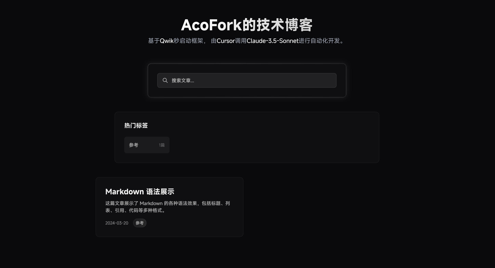

# Qwik-cursor-blog ⚡️

- [Qwik Docs](https://qwik.dev/)
- [Discord](https://qwik.dev/chat)
- [Qwik GitHub](https://github.com/QwikDev/qwik)
- [@QwikDev](https://twitter.com/QwikDev)
- [Vite](https://vitejs.dev/)

---
# 你需要知道的
- 本项目基于Qwik开发，所以你需要了解Qwik ~~不懂也没关系，因为我也不懂~~
- 本项目仅用于本人，不会解决我不想解决的问题
- 本项目有很多Bug（比如 `site.ts`大部分配置内容无效）。但是你发issue我也可能不会解决，因为这对我来说可能没有必要
- 本项目仍然欢迎提Pr，当然我更建议你直接Fork去深度修改为你的版本
- 本项目全程使用AI（Claude-3.5-Sonnet）进行开发，所以你可能会看到一些奇奇怪怪的代码
- 本项目使用MIT协议开源，你想干啥都行
- 如果你对这个项目有兴趣，或者对AI写代码有兴趣，喜欢折腾，那就自己凭实力找到我的联系方式联系到我

## 预览图


## 部署
```shell
npm install -g yarn
yarn install
yarn build.client && yarn build.server
// 输出目录为dist
```